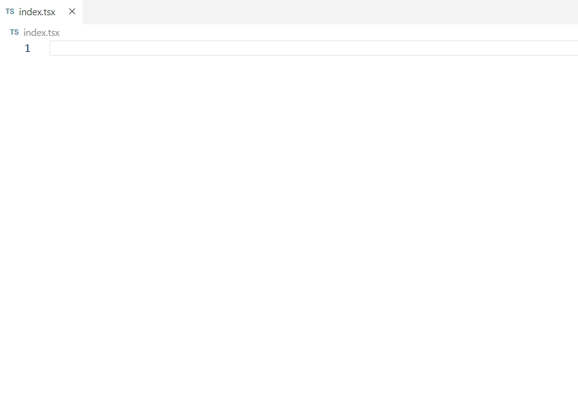

# React 18 Snippets

All avalible React 18 snippets you need.

---

## Snippets

| Snippet            | Renders                               |
| ------------------ | ------------------------------------- |
| `ri`               | Import React                          |
| `ridom Import`     | ReactDOM                              |
| `riustate`         | Import React, { useState }            |
| `riustateueffect`  | Import React, { useState, useEffect } |
| `riprototype`      | Import PropTypes                      |
| `rfc`              | Functional Component                  |
| `rafc`             | Arrow Functional Component            |
| `rcustomhook`      | Custom Hook                           |
| `racustomhook`     | Custom Hook (Arrow)                   |
| `rueffect`         | useEffect Hook                        |
| `rustate`          | useState Hook                         |
| `rucontext`        | useContext Hook                       |
| `ruref`            | useRef Hook                           |
| `rumemo`           | useMemo Hook                          |
| `rucallback`       | useCallback Hook                      |
| `rudebugvalue`     | useDebugValue Hook                    |
| `rudeferredvalue`  | useDeferredValue Hook                 |
| `ruid`             | useId Hook                            |
| `rulayouteffect`   | useLayoutEffect Hook                  |
| `rureducer`        | useReducer Hook                       |
| `rutransition`     | useTransition Hook                    |
| `rrender`          | render                                |
| `rfragment`        | Fragment                              |
| `rfragmentkey`     | Fragment with key prop                |
| `rprofiler`        | Profiler                              |
| `rstrict`          | StrictMode                            |
| `rsuspense`        | Suspense                              |
| `rforwardref`      | forwardRef                            |
| `rlazy`            | lazy                                  |
| `rstartTransition` | startTransition                       |
| `rmemo`            | memo                                  |
| `rroot`            | Create Root                           |
| `rhandle`          | handle function                       |
| `rahandle`         | handle arrow function                 |
| `rcontextprovider` | Context Provider                      |

---

## Developer Support:❤️

- If you saw some issue/bug 🐛 related to the specific release version.
- If you want some new feature or change to be added/implemented. 😊

Please, contact the creator of the **React 18 Snippets**, so he will be able to fix or improve it:

## Support my work

If you like my work and want to support me to work hard, please donate via:

| <a href="https://revolut.me/kristiyanvelkov" title="Link to Revolut">Revolut</a>                                                                                                                           | <a href="https://www.buymeacoffee.com/kristiyanVelkov" title="Link to Buy me a coffee">Buy me a coffee</a>                                                                                                                                                                                                                  |
| ---------------------------------------------------------------------------------------------------------------------------------------------------------------------------------------------------------- | --------------------------------------------------------------------------------------------------------------------------------------------------------------------------------------------------------------------------------------------------------------------------------------------------------------------------- |
|  |  |

Thanks a bunch for supporting me! It means a LOT 😍

---
